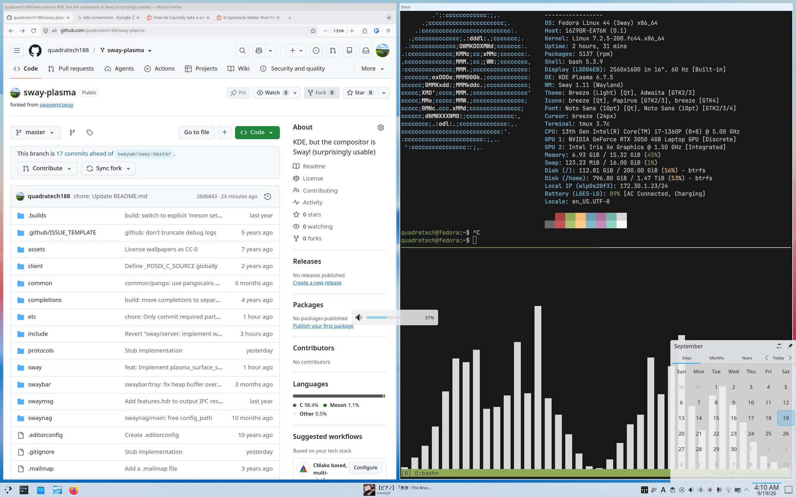

# `sway-plasma`

## What's here
- A partial implementation of KDE's [plasma-shell](https://wayland.app/protocols/kde-plasma-shell) wayland protocol in sway
    - `set_position` (Floats and correctly positions notifications, applets etc)
    - `set_role` (Correctly positions On-Screen Displays (volume / screen brightness etc))

- Sway now emulates KWin's layers (Critical notifications show over fullscreen, etc)
- Sway's resize behavior was changed so that edges not being dragged don't lag
- A script + `systemd` service that lets Sway replace `plasma-kwin_wayland.service` during KDE startup
- An `sway-extensions` executable that provides Kwin's:
    - `org.freedesktop.ScreenSaver` interface, which lets applications inhibit screen dimming

Everything that is not in the compositor lives in `./etc/`.

## Usage
Very unfriendly as of now.  

1. Compile `sway` and `sway-extensions`
2. `sed -i1 's|/home/quadratech/Projects/sway-plasma|<REPO LOCATION>|g' etc/*`
3. Create a new sway config, and in it source `./etc/sway-config`
4. Install `./etc/plasma-kwin_wayland.service` as a systemd user unit.
5. Install `./etc/kde-portals.conf` to `~/.config/xdg-desktop-portal/`
6. Select 'Plasma' from your display manager.
